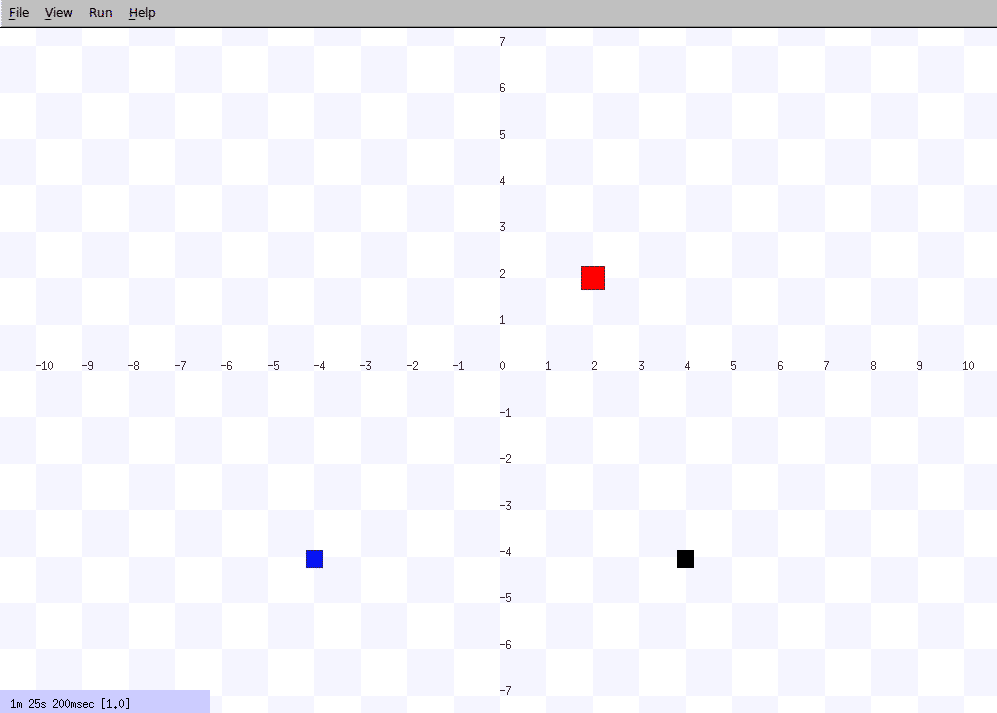
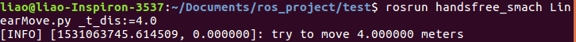
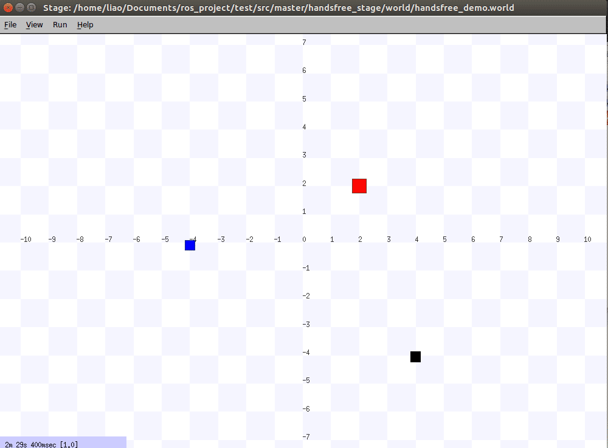
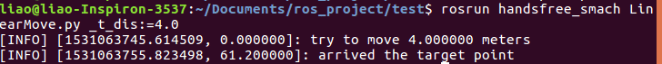

# 里程计及其简单应用

这部分我们将介绍里程计及其简单应用，通过这部分的学习，您将了解到里程计的含义以及里程计信息的获取方法，由此为[自主导航教程](http://wiki.hfreetech.org/docs/Tutorial/2.1-Navigation.html)和[雷达建图教程](http://wiki.hfreetech.org/docs/Tutorial/2.1-Mapping.html)的学习打下坚实基础。同时，在本节中所编写的简单应用也将在[行为树教程](http://wiki.hfreetech.org/docs/Tutorial/Advanced/Behavior-tree/)中被使用。


## 1.什么是里程计

**里程计**即[ROS官方教程](http://wiki.ros.org/navigation/Tutorials/RobotSetup/Odom)中所描述的Odometry，ROS将其抽象为如下消息结构体

```
Header header								# ROS消息包头
string child_frame_id						# 在ROS TF系统中底盘节点的名称
geometry_msgs/PoseWithCovariance pose		# 机器人当前的位置和姿态信息
geometry_msgs/TwistWithCovariance twist		# 机器人当前速度信息
```

其描述了机器人在世界坐标系中相对于"原点"(这个原点不固定，由用户自定义)的坐标信息(x，y，z)以及机器人的姿态信息---[Euler角](https://en.wikipedia.org/wiki/Euler_angles)(ROS中将Euler角转变为[四元数](https://en.wikipedia.org/wiki/Quaternion))。


## 2.如何得到机器人的里程计信息

获取里程计的方法有很多，常用的有运动学方法和多传感器信息融合。本篇教程将主要讲解运动学方法，有兴趣的读者，可自行了解一下视觉里程计以及惯导的相关算法，下面我们将着重介绍运动学方法。

在移动机器人的底盘驱动电机上，通常安装有编码器，通过对该编码器的脉冲数据进行处理，可获取该驱动电机累计转动的度数。随后再根据机械设计参数(例如机器人轮子半径，机器人轮子之间的距离等)和机器人对应的运动模型(差速，全向等)，便可计算得出机器人的当前里程计信息。(若有需要详细学习计算过程的读者，可参考[《自主移动机器人学导论》](https://baike.baidu.com/item/%E8%87%AA%E4%B8%BB%E7%A7%BB%E5%8A%A8%E6%9C%BA%E5%99%A8%E4%BA%BA%E5%AF%BC%E8%AE%BA/4461700)相关章节)


## 3.怎么使里程计更加准确

细心的读者可能会问，第二节中所涉及那些参数必然存在机械(生产过程，安装过程必然会引入误差)和测量上的误差， 那么通过运动学方法所结算得出的里程计信息准确吗？的确，通过运动学方法所获得的里程计信息时不准确的，就算不存在机械和测量上的误差，移动机器人的应用场景也很难找到完全水平的地面，因此机器人在长时间的运动情况下必然会因为累计误差而失去其定位，致使机器人无法进行自主移动。

那么如何解决这一棘手的问题，为机器人的自主提供准确的定位信息呢？这便涉及到SLAM(simultaneous localization and mapping)问题，其大致思想是将机器人所处环境信息于自身某些传感器数据进行融合，由此获取机器人当前定位信息的最优估计。(本篇文章不深入探讨SLAM算法的具体实现细节，有兴趣的读者可参考[《Slam For Dummies》](https://ocw.mit.edu/courses/aeronautics-and-astronautics/16-412j-cognitive-robotics-spring-2005/projects/1aslam_blas_repo.pdf)、[《Probabilistic Robotics》](https://docs.ufpr.br/~danielsantos/ProbabilisticRobotics.pdf)、[《State Estimation For Robotics》](http://asrl.utias.utoronto.ca/~tdb/bib/barfoot_ser17.pdf)进行学习)


## 4.一个里程计的简单应用-定点移动

为帮助读者更加合理的理解里程计，本节将使用ROS中的[tf tree](http://wiki.ros.org/tf/Tutorials)来实时获取机器人的定位信息，根据当前机器人里程计信息，来实现机器人的定点移动和定角度转动，由于定点移动和定角度转动的思想大致一致，故本节将主要讲解如何实现定点移动，所有源代码和demo均在我们的[github主页](https://github.com/HANDS-FREE/handsfree/tree/master/handsfree_smach)上。

##### 程序流程图如下所示:

```flow
start=>start: 输入前进/后退的目标距离t_dis，置已运动距离dis=0.0
end=>end: 已到达目标位置，机器人停止移动
move_robot=>operation: 发送速度
is_robot_arrived=>condition: t_dis-tol<=dis<=t_dis+tol?
start->move_robot
move_robot->is_robot_arrived
is_robot_arrived(no)->move_robot
is_robot_arrived(yes)->end

```

##### demo启动流程于对应效果如下所示:

* 1 打开stage模拟平台:

```
roslaunch handsfree_stage handsfree_simple_stage.launch
```

桌面出现stage画面:



图中蓝色小方块为机器人，其正处于stage坐标系中的(-4.0, -4.0)位置，面朝Y轴正方向


* 2 运行定点移动程序并赋值是机器人前进4.0米(**请先确认LinearMove.py程序已获得可执行权限**)

```
rosrun handsfree_smach LinearMove.py _t_dis:=4.0 
```

终端输出如下:




* 3 观察stage窗口，此时stage中的蓝色小方块正向前移动，在经过一段时间后，机器人到达目标位置。此时终端输出和stage状态如下所示



